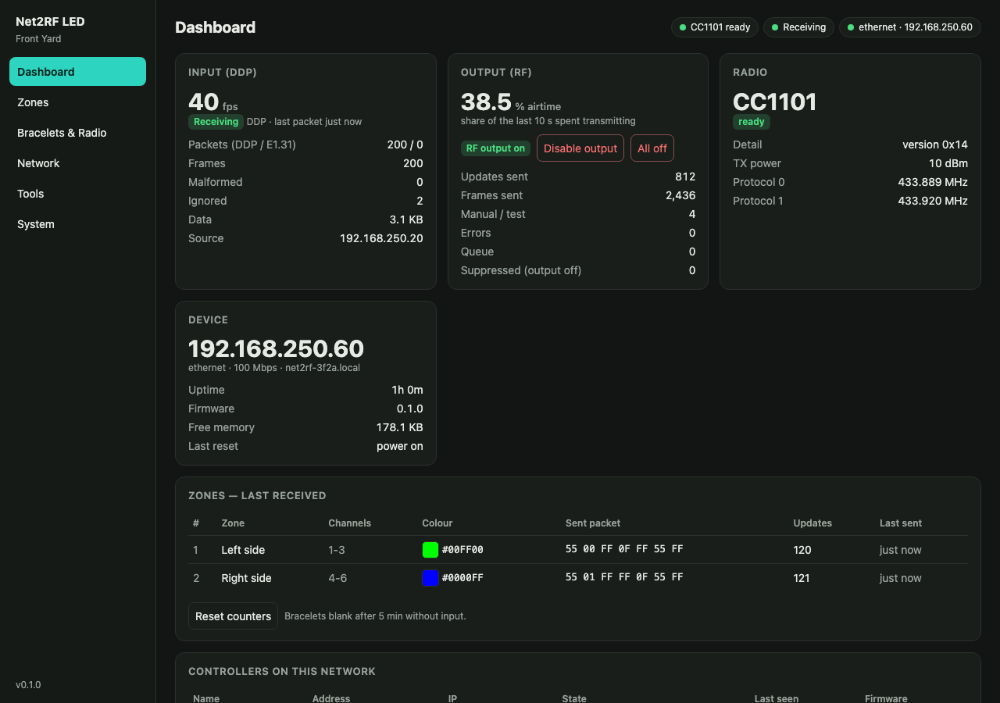

# Net2RF LED

**Show network to 433 MHz RF.** Pixel or DMX data in over DDP or E1.31, radio out. Drives 433 MHz wireless
LED show products (the bracelets, light sticks, pucks and wands handed out at concerts and stadiums) from
**xLights, Falcon Player or any DDP / E1.31 source**.

```
xLights / FPP ──DDP / E1.31──▶ WT32-ETH01 (ESP32 + Ethernet) ──▶ CC1101 or Ra-02 ──433 MHz──▶ bracelets, sticks, pucks
```

In xLights, a group of bracelets is just a **single pixel**: add a 1-node Single Line model to an existing model
group (your floods, say) and the crowd's bracelets follow along. No DMX fixtures to set up. Already have the
bracelets set up as DMX (for example for the vendor's DMX transmitter)? That configuration should keep working,
using the DMX or vendor input mode (not yet tested on hardware).

**▶ See it working:** [prototype demo on YouTube](https://youtube.com/shorts/mfn99Rj19TI): breadboard build,
a bracelet following an xLights sequence, and the web UI.

[](https://youtube.com/shorts/mfn99Rj19TI)



## Project status

> **Early prototype: DIY only, tested on one setup.** It works end to end: an xLights sequence drives a
> bracelet over DDP. But most features haven't seen real hardware yet. Expect rough edges, and please report
> what you find.

| | |
|---|---|
| ✅ **Tested** | WT32-ETH01 + CC1101 (433 MHz) DIY build · **Shenzen New Dody** bracelets (protocol 0), one bracelet · xLights over **DDP, pixel mode** · **DMX** input mode (colours) · **E1.31** unicast · web UI, Wi-Fi setup through the setup hotspot, firmware updates over the network · SSD1306 OLED · zone walk and address probe · controller list and `net2rf.local` election (against simulated controllers) |
| 🧪 **Built, not yet tested on hardware** | **LedGiftSupplier** bracelets (protocol 1, RGB + group codes) · **vendor DMX** input mode · E1.31 multicast · **Ra-02 / SX1278** radio · two real controllers side by side, listen before transmit backing off · Home Assistant examples · range across a full yard |
| ❌ **Not working yet** | Protocol 0 built-in effects: the tested bracelet ignores them |
| 🛠 **Coming soon** | A carrier board and enclosure |

Full list of what's been tried: [docs/DEVICES.md](docs/DEVICES.md). What we know about the bracelets
themselves (one model tested so far, a giveaway bracelet from a Banana Ball game):
- **Waking up:** they need a press of their button before they listen to the radio.
- **Idle behaviour:** they turn red by themselves after ~20 minutes without a command, but keep listening.
- **Effects:** colours and off work; the built-in effect commands don't (yet).
- **Zones:** protocol 0 uses a 16-bit group mask. The tested bracelet is on group 3; others may differ. See
  [PROTOCOL.md](docs/PROTOCOL.md).

## Features

- **Two bracelet families:** Shenzen New Dody (10-colour palette) and LedGiftSupplier.com (RGB, group codes).
  Bracelets and light sticks both work the same way.
- **Zones:** up to 16 groups per controller, each one RGB pixel in xLights (pixel mode), a DMX fixture with an
  effect channel (DMX mode), or the vendor transmitter's 5-channel layout (vendor mode).
- **DDP and E1.31 input**, unicast or multicast; Ethernet or Wi-Fi, with a setup hotspot for first-time config.
- **Web UI for everything:** live input rate and counters, last colour per zone, test mode, zone walk, address
  probe ("which group is this bracelet in?"), xLights setup helper, network settings, firmware update with
  automatic rollback, settings export/import, optional admin password.
- **Show-safe:** an RF output switch and an *All off* button; bracelets blank themselves when the show stops
  sending (5 minutes by default).
- **Several controllers:** each one lists the others with their live state, and one always answers at
  `net2rf.local`. Optional listen-before-transmit keeps neighbouring controllers from talking over each other.
- **Optional OLED and USER button:** IP and status at a glance; holding the button resets the network settings or
  the whole controller.
- **JSON API:** for Home Assistant, Grafana or scripts.

## Hardware

| | Status | Guide |
|---|---|---|
| **DIY build:** WT32-ETH01 + CC1101 or Ra-02, wired by hand | Works today | [Assembly guide, part A](docs/ASSEMBLY.md#a-diy-build) |
| **Carrier board** | 🚧 Coming soon | [Assembly guide, part B](docs/ASSEMBLY.md#b-carrier-board-coming-soon) |

The DIY build needs:
- a WT32-ETH01;
- a 433 MHz CC1101 module with antenna;
- a 5 V supply;
- a 3.3 V USB-serial adapter for the first flash;
- optionally an OLED and three buttons.

Full parts list, with where to buy: [ASSEMBLY.md, Parts](docs/ASSEMBLY.md#parts).

## Getting started

1. **Build and flash:** [docs/ASSEMBLY.md](docs/ASSEMBLY.md) covers parts, pinout, wiring and flashing. The
   [browser flasher](https://mikeneiderhauser.github.io/net2rf-led/) (Chrome / Edge) installs the latest release over USB, no build tools needed.
2. **Get connected:** the [user guide](docs/USAGE.md) covers the network, the setup hotspot, the web UI and the
   buttons.
3. **Add the bracelets to your show:** [docs/SETUP.md](docs/SETUP.md) covers the show network, finding your
   bracelet type and groups, a range check, adding the controller to xLights / FPP, and sequencing tips.

## Documentation

| Doc | What's in it |
|---|---|
| [DEVICES.md](docs/DEVICES.md) | Tested bracelets and controller hardware, and how to report a new device |
| [ASSEMBLY.md](docs/ASSEMBLY.md) | Parts, pinout, wiring, first-time flashing |
| [USAGE.md](docs/USAGE.md) | User guide: connecting, setup hotspot, web UI, buttons/LED/OLED, updates, recovery |
| [SETUP.md](docs/SETUP.md) | Adding bracelets to an existing xLights / FPP show |
| [RF.md](docs/RF.md) | Range, multiple controllers, listen before transmit, key fobs, the rules |
| [PROTOCOL.md](docs/PROTOCOL.md) | The bracelets' 433 MHz protocols, and what's known about each |
| [API.md](docs/API.md) | HTTP API, settings, stats, controller discovery |
| [HOME_ASSISTANT.md](docs/HOME_ASSISTANT.md) | Sensors, switches and automations |
| [TODO.md](TODO.md) | Open items and things waiting for hardware tests |

## Roadmap

- **Carrier board and enclosure:** in the works; details once it has been built and tested.
- **Broader testing:** LedGiftSupplier bracelets, vendor mode, the Ra-02, range across a yard, two real
  controllers with listen before transmit.
- **Bracelet behaviour:** confirm protocol 0 group addressing with more bracelets; find the real effect
  commands; deal with idle and sleep (e.g. a keep-alive so bracelets don't drift to red between songs).
- **FPP discovery,** so controllers show up in FPP's MultiSync page and xLights' controller discovery.

Have bracelets from another vendor or batch, or ideas? Open an issue. Captures and test reports are especially
welcome; [DEVICES.md](docs/DEVICES.md#reporting-a-device) lists what helps.

## Development

```bash
pio run -e wt32-eth01                  # build firmware.bin and firmware.factory.bin
pio test -e native                     # unit tests: packet encoder, DDP/E1.31 parsers, radio maths, heartbeat
python3 tools/mock_server.py           # develop the web UI against a fake API at http://127.0.0.1:8765/
python3 tools/ddp_test.py <ip> cycle   # send DDP without xLights
python3 tools/peer_sim.py --to <ip>    # simulate other controllers on the network
```

| Path | What it is |
|---|---|
| `src/` | The firmware: engine (zones, scheduling, RF), network, web server, OLED/button, peers |
| `web/index.html` | The web UI (gzipped into the firmware at build time) |
| `lib/bracelet_protocol` | Bracelet packet encoder and DDP / E1.31 parsers (pure C++, unit tested) |
| `lib/cc1101_ook`, `lib/sx1278_ook` | Minimal radio drivers for OOK transmit and listen-before-talk |
| `lib/net2rf_heartbeat` | Controller heartbeat format (unit tested) |

## License and legal

Copyright (C) 2026 Mike Neiderhauser and contributors.

Licensed under the **GNU General Public License v3.0 or later** ([LICENSE](LICENSE)). You may use, modify and
sell it, including in products. If you distribute it, modified or not (for example in a controller you sell),
you must make the corresponding source available under the same licence.

The bracelet protocols were worked out from the behaviour of a Flipper Zero app; no third-party code from it is
included. Libraries used at build time (ArduinoJson and the ThingPulse OLED driver, MIT; Arduino-ESP32 and
ESP-IDF) and the browser flasher (ESP Web Tools) carry their own licences.

433 MHz transmission is regulated. The controller transmits what it's sent, at the power you set; staying within
local rules is up to the operator. See [docs/RF.md](docs/RF.md#legal).
