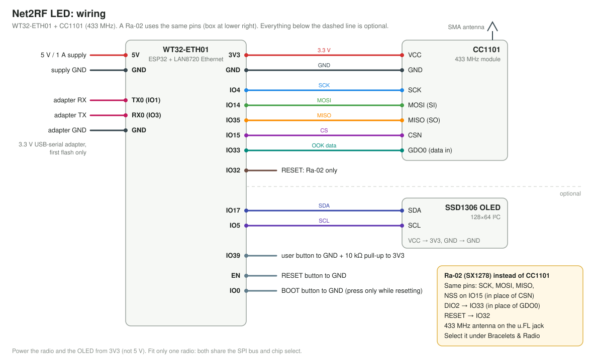

# Assembly and installation

Two ways to build a controller:

- **[A. DIY build](#a-diy-build)**: a WT32-ETH01 and a radio module wired together. Available now; this is
  what the firmware has been tested on.
- **[B. Carrier board](#b-carrier-board-coming-soon)**: coming soon.

Both run the same firmware with the same pin assignment. Once flashed, the [user guide](USAGE.md) covers
connecting and everyday use, and [SETUP.md](SETUP.md) covers adding the bracelets to your show.

---

## A. DIY build

### Parts

| Part | Notes |
|---|---|
| **WT32-ETH01** | ESP32 + LAN8720 Ethernet. Power it with 5 V; its own 3.3 V regulator also supplies the radio and OLED. (Not the "WT32-ETH01-EVO", which is a different chip and pinout.) |
| **Radio, one of:** | Chosen in the web UI (*Bracelets & Radio → Radio module*), no recompiling. Fit only one. |
| CC1101 module, **433 MHz** | The blue 2×4-header board with an SMA jack, e.g. [AOICRIE CC1101 + antenna](https://www.amazon.com/gp/product/B0D2TMTV5Z). −30 to +10 dBm. **Tested.** Multi-band listings ("315/433/868/915") are only tuned for one band: make sure yours is 433 MHz. |
| Ai-Thinker Ra-02 (SX1278, 433 MHz) | [Ra-02 module](https://www.amazon.com/SX1278-Ai-Thinker-Wireless-Spectrum-Transmission/dp/B0CP778J3T): +2 to +17 dBm, the long-range option. **Supported, not yet tested on hardware.** It has a u.FL antenna connector and 2 mm pads, so use a breakout: [ACROBOTIC Ra-02 breakout](https://www.amazon.com/ACROBOTIC-Breakout-Arduino-ESP8266-Raspberry/dp/B07MNH5W65), or [Adafruit RFM96W 433 MHz](https://www.adafruit.com/product/3073) (equivalent chip, 0.1" header). |
| 433 MHz antenna | SMA whip (CC1101) or u.FL→SMA pigtail + whip (Ra-02). Mount it high. |
| 128×64 I²C OLED (optional) | SSD1306 (0.96") or SH1106 (1.3"), selectable under *System → Display*. Shows IP, radio status, input rate, zone colours. Everything works without it. |
| 3 × tactile buttons | EN (reset), BOOT (IO0), and an optional USER button on IO39. |
| 10 kΩ resistor | Pull-up for the USER button (IO39 has no internal pull-up). |
| 330 Ω–1 kΩ resistor | In series with the radio data line (IO33). Cheap insurance against two outputs fighting. |
| 3.3 V USB-serial adapter | FT232 / CH340 / CP2102 "FTDI" board, for the first flash only. Set it to **3.3 V**. |
| 5 V / 1 A supply | The controller draws ~400 mA worst case. |

**Avoid** UART "LoRa" modules (EBYTE E32/E22, DL-LL02): they can't send raw OOK.

Links are examples of matching parts, not endorsements. Listings change, so check the band (433 MHz) before buying.

### Pinout



The WT32-ETH01 silkscreen labels some pins by their original serial-bridge function; both names are given below.

#### Radio (fit one; both use the same pins)

| WT32-ETH01 pin | Silkscreen | Function | CC1101 | Ra-02 (SX1278) |
|---|---|---|---|---|
| 3V3 | 3V3 | Power | VCC | 3.3V |
| GND | GND | Ground | GND | GND |
| IO14 | IO14 | SPI SCK | SCK | SCK |
| IO15 | IO15 | SPI MOSI | MOSI (SI) | MOSI |
| IO35 | IO35 | SPI MISO | MISO (SO) | MISO |
| IO4 | IO4 | Radio CS | CSN | NSS |
| IO33 | 485_EN | OOK data (via 330 Ω–1 kΩ) | GDO0 | DIO2 |
| IO32 | CFG | Radio reset | not used | RESET |

The firmware checks the CC1101's GDO0 → IO33 connection at boot. A broken data wire shows as **data line fault**
on the dashboard, instead of the radio silently keying up with nothing on it.

#### Everything else

| WT32-ETH01 pin | Silkscreen | Function | Connection |
|---|---|---|---|
| 5V | 5V | Power in | 5 V supply |
| IO5 | RXD | I²C SDA | OLED SDA (optional) |
| IO17 | TXD | I²C SCL | OLED SCL (optional) |
| IO39 | IO39 | USER button (optional) | button to GND, 10 kΩ pull-up to 3V3 |
| IO2 | IO2 | Status LED (optional) | LED + 1 kΩ to GND |
| IO1 | TXD0 | Serial TX | adapter **RX** (first flash) |
| IO3 | RXD0 | Serial RX | adapter **TX** (first flash) |
| EN | EN | Reset | button to GND |
| IO0 | IO0 | BOOT | button to GND |

- Leave **IO12** unconnected: it must be low at boot.
- Don't put pull-ups on **IO2**: they break serial flashing.
- **IO0** is also the Ethernet 50 MHz clock once running. Only press BOOT while resetting, and keep wiring
  on it short.
- The OLED pins are labelled `RXD`/`TXD`, not `TXD0`/`RXD0`, which is easy to mix up. If SDA and SCL are
  swapped, the firmware detects it and carries on.

### Flashing

#### First time (serial)

1. Wire the USB-serial adapter, set to **3.3 V logic**:

   | Adapter | WT32-ETH01 |
   |---|---|
   | GND | GND |
   | TX | RXD0 (IO3) |
   | RX | TXD0 (IO1) |

   Power the WT32-ETH01 from its own 5 V supply: an adapter's 3.3 V pin can't supply enough current.
2. Enter the bootloader: **hold BOOT, tap EN, release BOOT**.
3. Flash, either way:
   - **Browser:** open the web flasher (Chrome or Edge) and click **Install**. Once the repository is public,
     CI publishes the flasher with each release; see [`flasher/`](../flasher/).
   - **Command line:**
     ```bash
     python3 -m esptool --chip esp32 write-flash 0x0 firmware.factory.bin
     ```
     `firmware.factory.bin` contains the bootloader, partition table and app, so it goes at address `0x0`.
     Building from source: `pio run -e wt32-eth01` writes it next to `firmware.bin`.
4. Tap **EN** to run the new firmware.

#### Afterwards

Screw the antenna on **before** powering up, then see the [user guide](USAGE.md) for connecting to the controller,
the buttons, LED and OLED, and firmware updates over the network (no cable needed after the first flash).

### Power budget

| Load | Current |
|---|---|
| ESP32 + Ethernet | ~250 mA peak |
| Ra-02 transmitting at +17 dBm | ~90 mA |
| CC1101 transmitting | ~30 mA |
| OLED | ~20 mA |

About 400 mA worst case, within the WT32-ETH01's regulator. Use a 5 V / 1 A supply.

---

## B. Carrier board (coming soon)

> 🚧 **Under construction.** A carrier board the modules plug into is in the works. Details will follow once it
> has been built and tested. Until then, use the [DIY build](#a-diy-build); the carrier board will use the same
> firmware and pin assignment.
