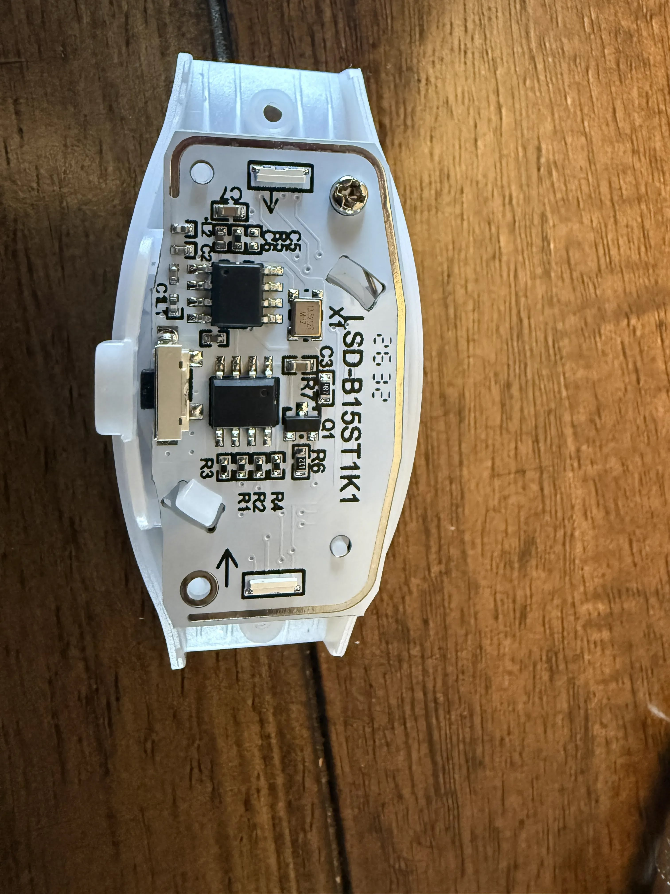

# Tested hardware and devices

What has actually been run against real hardware, and what's only supported on paper. If you try something
that isn't listed, please [report it](#reporting-a-device): every report widens the list.

**Status key:**
- ✅ **tested:** run on real hardware.
- 🧪 **supported, untested:** implemented, but not yet run on real hardware.
- ❔ **unknown:** not checked yet.

## RF devices (bracelets, sticks, pucks)

### ✅ Banana Ball bracelet (protocol 0)

| | |
|---|---|
| Where from | LED bracelet from a Banana Ball game |
| PCB marking | `SD-B15ST1K1` |
| Radio | 433 MHz receiver; 13.52127 MHz crystal (`X1`); loop antenna around the board edge; main chips unmarked |
| Controls | push button |
| Protocol | **0, Shenzen New Dody** (lights red in *Tools → Which bracelet do I have?*) |
| Colours | The protocol's 10 fixed colours |
| Address | **Group 3:** answers `0008000F` (and the all-groups default `00FFFF0F`), not the other single-bit masks. Other bracelets may be on different groups. |
| Tested with | WT32-ETH01 + CC1101, xLights over DDP in pixel mode: follows the sequence |

What to know:
- **Wake it first.** It ignores the radio until its button is pressed.
- **Latches.** It holds the last colour (or off) until it gets a new command.
- **Idle red.** About 20 minutes after the last command it turns red by itself, but keeps listening. The next
  colour change brings it back. It's not yet known whether this is idle or low battery, and whether it sleeps
  later.
- **One unit tested.** This bracelet is on group 3; others (even from the same event) may be on different
  groups. Use the address probe to check yours.

### 🧪 LedGiftSupplier.com bracelets and light sticks (protocol 1)

Supported from the protocol as decoded from the Flipper Zero app and the vendor's DMX transmitter guide: RGB with 16
levels per channel, group codes, group 0 = all. Not yet tested with a real device. This is the protocol the
vendor's "DMX to RF transmitter" kits use.

### ❔ Other products

RF pucks, wands, hats and the like (for example Wally's Lights' "DMX to RF" range, organised in zones 1–4) may use
one of these two protocols or something else. Try *Tools → Which bracelet do I have?* and report the result.

## Controller hardware

| Part | Status | Notes |
|---|---|---|
| WT32-ETH01 (ESP32 + LAN8720) | ✅ | Ethernet and Wi-Fi both used. Not the WT32-ETH01-EVO (different chip and pinout). |
| CC1101 433 MHz module, blue 2×4 header + SMA ([AOICRIE](https://www.amazon.com/gp/product/B0D2TMTV5Z)) | ✅ | Reports chip version `0x14`; data-line self-test passes; drives the Banana Ball bracelet. |
| Ai-Thinker Ra-02 (SX1278) on a breakout | 🧪 | Driver written to the datasheet; never run. |
| SSD1306 0.96" I²C OLED | ✅ | Including detection of swapped SDA/SCL. |
| SH1106 1.3" I²C OLED | 🧪 | Selectable under *System → Display*. |
| 3.3 V USB-serial adapter (FTDI-style) | ✅ | First flash; updates are then over the network. |
| Carrier board | 🚧 | Coming soon ([ASSEMBLY.md, part B](ASSEMBLY.md#b-carrier-board-coming-soon)). |

## Software and features

| | Status |
|---|---|
| xLights → DDP, pixel mode | ✅ (controller profile WLED / WLED / Generic ESP32, Keep Channel Numbers off) |
| xLights → DDP, DMX mode / vendor mode | 🧪 |
| E1.31 (sACN), unicast / multicast | 🧪 |
| Falcon Player (FPP) as the show player | 🧪 (should work over DDP / E1.31 like xLights) |
| Web UI, setup hotspot, Wi-Fi join, firmware update with rollback | ✅ |
| Test mode, zone walk, address probe | ✅ |
| Several controllers (live list, `net2rf.local` election) | 🧪 (one controller so far) |
| Listen before transmit | 🧪 (needs two radios in range) |
| Home Assistant examples | 🧪 |

## Reporting a device

Open an issue with:

1. **Photos** of the device, outside and the PCB (markings, crystal, chips), like the one above.
2. **Where it came from:** event, vendor, listing.
3. **Protocol:** what *Tools → Which bracelet do I have?* shows (red = 0, green = 1, nothing).
4. **Address:** what *Tools → Address probe* finds (see [SETUP.md](SETUP.md#3-decide-how-the-bracelets-fit-into-the-show)).
5. **Behaviour:** does it need a button press to listen, what does it do when idle, and how long does it last on
   its batteries?
6. Your controller hardware and firmware version (*System* page).
