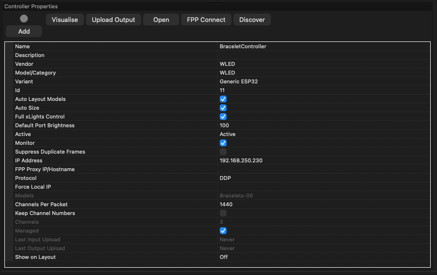
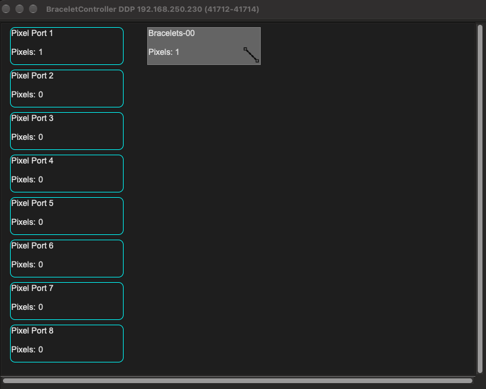

# Adding bracelets to your show

You already have a light show running from xLights (or Falcon Player). This guide adds the audience's LED
bracelets, light sticks or pucks to it as one more prop: the controller joins your show network like any other
controller, and each group of bracelets becomes a single pixel you sequence alongside everything else.

**Before you start:**
- a controller built and flashed ([ASSEMBLY.md](ASSEMBLY.md));
- a couple of bracelets to test with;
- access to your show network and xLights layout.

## 1. Put the controller on your show network

(Details: [user guide, Connecting](USAGE.md#connecting).)

- **Ethernet (recommended):** plug it into the same network as your other controllers, and open
  `http://net2rf.local/` (or the IP from the OLED or your router).
- **Wi-Fi:** if it can't find a network it opens its own, **NET2RF-XXXX** (password `net2rf1234`). Join it; the
  setup page opens. Enter your show Wi-Fi under **Network** and save, and the controller reboots onto it.
  The ESP32 only does 2.4 GHz.

Check the dashboard: the radio should read **CC1101 ready** (or SX1278). *Not detected* means wiring or power to the
radio, or the wrong module selected under **Bracelets & Radio**.

Then give it a **static IP** (or a DHCP reservation) under **Network**, so xLights always finds it like your
other controllers, and optionally an **admin password** under **System**.

## 2. Find out which bracelets you have

1. Switch a bracelet on **and press its button**. Many bracelets ignore the radio until they're woken this
   way. Hold it a few metres from the antenna.
2. **Tools → Which bracelet do I have? → Start test.** The controller alternates:
   - **red** = protocol 0 (Shenzen New Dody)
   - **green** = protocol 1 (LedGiftSupplier.com)
3. Click the matching **use protocol** button.

Nothing lights? Press the bracelet's button again (it may have gone back to sleep), check its battery, move closer,
and raise **TX power**.

## 3. Decide how the bracelets fit into the show

Every bracelet in a **zone** shows the same colour, and each zone is one pixel in xLights. Choose how many you
need:

- **One look for the whole audience:** a single zone that reaches every bracelet. This is the default, and
  the simplest way to start.
- **Sections:** one zone per group of bracelets, for example left and right of the yard, or kids' and adults'
  bracelets. It only works if your bracelets come in different groups. Find out with the steps below.

### Protocol 1 (LedGiftSupplier)

Every bracelet belongs to a **group**, and group **0** reaches all of them. Find each bracelet's group with **Tools →
Address probe** (protocol 1, field *Group (byte 1)*, mode *Sweep*, 1 → 20), pressing **★ Bracelet reacted** when it
lights. Then add a zone per group on the **Zones** page and check each with **Send**.

Avoid mixing a group-0 zone with specific groups unless you mean it: every change on the group-0 zone overrides
all of them (the Zones page warns you).

### Protocol 0 (Shenzen New Dody)

The default address `00FFFF0F` reaches every bracelet. Bytes 2-3 (`FFFF`) look like a 16-bit **group mask**,
one bit per group. The one bracelet tested so far is on group 3 (`0008000F`); yours may be on another.

1. **Tools → Address probe:** protocol 0, field *Mask bytes 1-2*, mode *Walk single bits*, step time **3 s** or
   more. Wake the bracelet first, then press **★ Bracelet reacted** when it lights. The mark records the address
   on screen, so a slow press can land on the next step; repeat to be sure.
2. Add a zone with that address (`00` + mask + `0F`), save, and check it with the **Zone walk** on the Zones
   page. Combining bits (`0009000F` = groups 0 and 3) should address several groups at once.

Please report what your bracelets answer to: it's how this gets confirmed.

## 4. Check the range where the audience will be

1. Mount the antenna where it will live during the show: high, clear of metal, with a view of where people stand.
2. **Dashboard → Test mode → Cycle R/G/B/W.**
3. Walk the edges of the audience area with a bracelet. It should change colour every 2 seconds.
4. Lower **TX power** (Bracelets & Radio) until the far edge just starts to miss, then go back up a step or two.
   Less power means fewer problems for your neighbours' car key fobs.
5. Switch test mode **Off**.

## 5. Add it to xLights

Treat it like any other Ethernet controller in your setup. **Tools → xLights setup** on the controller lists the
exact settings for its current zones.

1. **Controllers → Add E1.31/Artnet/DDP:** protocol **DDP**, the controller's IP, channels as listed. Leave **Keep Channel
   Numbers** unticked: with it on, xLights sends absolute show channel numbers and the controller ignores them
   (the dashboard then shows *Wrong channels*). For **E1.31**, use the universe set under *Bracelets & Radio*.
   - **Vendor / model:** **WLED**, model **WLED**, variant **Generic ESP32** (tested). It keeps xLights'
     controller visualiser, which a vendor-less controller loses. This profile shows **8 ports**: put all bracelet
     models on **port 1** and leave the others empty, since the controller only reads one channel range. Don't use
     xLights' *upload* actions on it: the controller doesn't speak WLED's configuration API, so they just fail
     (show data is unaffected). A dedicated Net2RF LED controller definition for xLights is planned.
   - **Channels per packet:** leave the default (e.g. 1440). It's an upper limit, and the controller only uses a
     handful of channels (3 per zone), so each frame fits in one packet anyway.

   A working setup (one zone, so 3 channels; *Auto Size* fills the channel count in from the models):

   

   In the controller visualiser, the bracelet model sits on **Pixel Port 1** and ports 2-8 stay empty:

   
2. **Layout:** add the bracelet model(s) and assign them to this controller.
   - **Pixel mode (3 channels per zone, recommended):** one *Single Line* model with 1 node per zone, or a 1-node
     *Single Line* per zone at start channels 1, 4, 7..., string type *RGB Nodes* (matching the colour order
     setting). Place each one where that part of the audience stands.
   - **DMX mode (4 per zone, untested):** a *DmxFloodlight* per zone (start 1, 5, 9...) with Red 1, Green 2,
     Blue 3. Channel 4 is an effect channel: 0-19 follow RGB, 20-39 off, 40-59 / 60-79 / 80-99 the bracelets'
     built-in effects A / B / C (protocol 0; the tested bracelet ignores them, see [DEVICES.md](DEVICES.md)).
   - **Vendor mode (5 per zone, LedGiftSupplier, untested):** the vendor DMX transmitter's own layout. Per
     zone, a 2-channel DMX model at the zone's start channel with channel 1 = 85 (transmit) and channel 2 =
     group, plus a 1-node *Single Line* at start + 2 for the colour. An existing DMX setup for the vendor's
     transmitter should keep working as it is.
3. **Model groups:** add the bracelet model(s) to an existing group, such as your floods or "whole house".
   Sequences with effects on that group then drive the bracelets with no extra work. Add them to a
   **Bracelets** group as well, for bracelet-only moments.
4. **Falcon Player:** if FPP plays your show, push the updated output configuration to it as you do for your
   other controllers (e.g. *FPP Connect*). FPP then sends DDP to the bracelet controller.
5. Play a sequence. The dashboard shows the input frame rate climbing and each zone's colour following.

## 6. Sequencing tips

- **Existing sequences:** bracelets only light where an effect covers their model, either through a group you
  added them to or directly. Render, play, and see which songs need a touch-up.
- **Speed:** the radio manages roughly **5-10 colour changes per second** across all zones, ~100-150 ms behind the
  music. Bold, slow effects (On, Color Wash, Fill, slow Marquee) read best; fast twinkles and sparkles turn into
  random flicker. Effects that look great on pixel props may be too busy for bracelets.
- **Colours:** protocol 0 bracelets have **10 fixed colours** (red, green, blue, pink, white, yellow, violet,
  orange, indigo, cyan); anything else snaps to the nearest. Fades become steps.
- **Black = off:** to blank the bracelets, set their pixel to black, or leave a gap with no effect (xLights
  outputs black there). Protocol 0 sends its real *off* command for anything darker than the off threshold
  (16/255 by default), so a fade snaps off near the end rather than dimming smoothly. It's sent once; the
  bracelets stay dark until the next colour. (*RF output off* and vendor mode's channel 1 ≠ 85 stop
  transmitting instead, and the bracelets **hold** their last colour.)
- **Moments:** bracelets have the most effect at big beats, drops and finales. Constant changes add airtime
  without adding much.

## 7. Show night

- **All off** on the dashboard blanks every bracelet at once.
- **Disable output** stops all RF without touching xLights; turn it back on and the current colours are re-sent.
- If the show stops sending for 5 minutes, the bracelets blank themselves (**Blank after no input**).
- Bracelets idle for ~20 minutes may turn red by themselves; the next colour change brings them back.
- Handing bracelets out? Press their buttons first so they're listening.
- More than one bracelet controller? Read [RF.md](RF.md#multiple-controllers) first.
- Home Assistant can watch `/api/stats` and switch output on a schedule: see [HOME_ASSISTANT.md](HOME_ASSISTANT.md).
