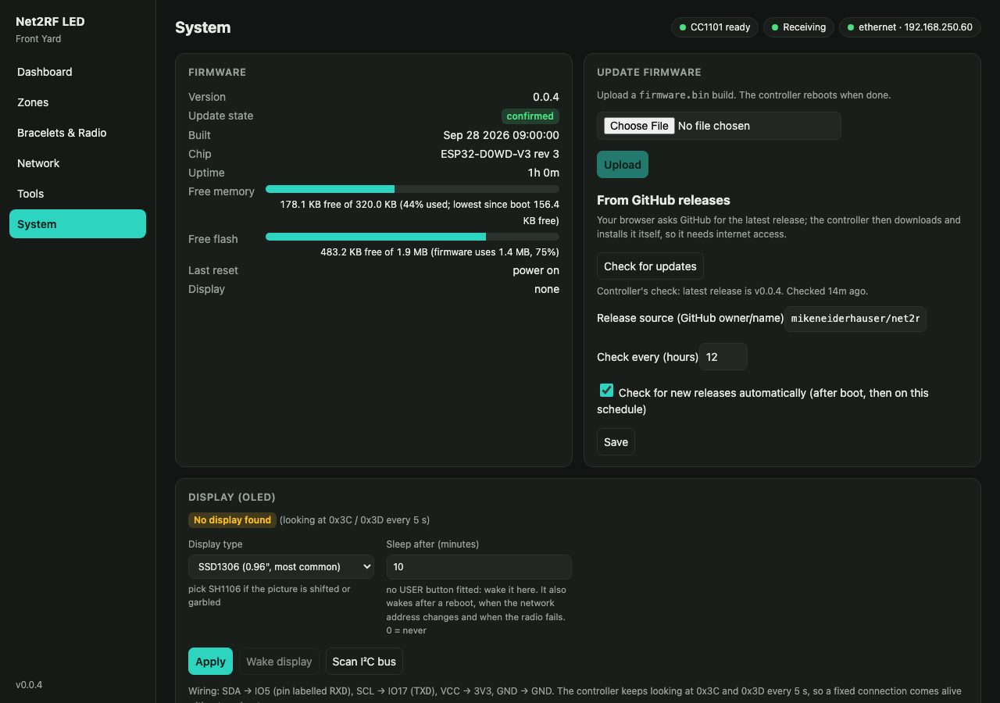

# User guide

How the controller behaves and how to use it day to day. Building and first-time flashing:
[ASSEMBLY.md](ASSEMBLY.md). Adding the bracelets to your show: [SETUP.md](SETUP.md).

## Powering up

- **Antenna first.** Screw the antenna on before applying power.
- **What happens at boot:** the network and web UI come up first, and the radio is checked in the background. The
  dashboard shows *radio initializing*, then *ready*, or *not detected* if the module doesn't answer (it keeps
  retrying every 10 s).
- **Settings are kept** across power cycles and firmware updates.

## Connecting

The controller prefers **Ethernet**. Without an Ethernet link it uses **Wi-Fi** if one is configured. If it has no
connection after 15 s, it opens its own **setup hotspot**.

| How | Address |
|---|---|
| Ethernet / Wi-Fi | `http://net2rf.local/` (one controller on the network answers it), its own `http://net2rf-xxxx.local/`, or its IP (shown on the OLED, or in your router's client list) |
| Setup hotspot | Join **NET2RF-XXXX** (password `net2rf1234`). The setup page opens by itself, or browse to `http://192.168.4.1/` |

### The setup hotspot

- It opens when there's no Ethernet link and no Wi-Fi connection for 15 s. It closes again once the controller
  is connected and nobody is using the hotspot.
- To join your Wi-Fi: go to **Network**, then **Scan for networks**, pick yours, enter the password and choose
  **Save & reboot**. After the reboot, reconnect your phone or laptop to your normal Wi-Fi and open
  `http://net2rf.local/`. If it couldn't join, the hotspot comes back within about 20 s and the Network page
  shows why: network not found (the ESP32 only does **2.4 GHz**), wrong password, or weak signal.
- **Phones:** the sign-in window that pops up when you join the hotspot works for settings, but can't pick files.
  For a firmware update or a settings import, open `http://192.168.4.1/` in Safari or Chrome instead.
- Under **Network → Setup access point** you can keep the hotspot always on, or turn it off completely. It
  can't be turned off while neither Ethernet nor Wi-Fi is configured.

### Network settings

**Network** sets the hostname, Ethernet on/off, Wi-Fi network, DHCP or a static IP (used on whichever
interface is active), and the hotspot mode and password. Saving reboots the controller.

For a show, give the controller a **static IP** or a DHCP reservation, so xLights / FPP always find it.

## The web UI

| Page | What's there |
|---|---|
| **Dashboard** | Input rate and packet counters, RF airtime and counters, radio status, device info with free memory and flash; a notice when newer firmware is available; the last colour sent to each zone; other controllers on the network with their live state; **Test mode** (off, solid colour, or cycle R/G/B/W); **RF output on/off**, **Shut down radio** and **All off** |
| **Zones** | Add, name, enable and address zones; choose whether All Zones is a base layer under the others; send a colour, off, a fade in or a fade out to one zone; **Zone walk** lights one zone at a time so you can see which bracelets belong where |
| **Bracelets & Radio** | Controller name, bracelet protocol, input mode (pixel / DMX / vendor), colour order and start channel; radio module, TX power, frequencies, frames per update, refresh, TX jitter, listen before transmit; DDP / E1.31 input and the input timeout |
| **Network** | Current connection and the settings above |
| **Tools** | **xLights setup** (exact controller and model settings for the current zones); **Which protocol is my device?**; **Send raw packet**; **Address probe** (find which group a bracelet is in) |
| **System** | Firmware info (version, free memory, free flash) and **Update firmware** (from GitHub releases or a file); an **Advanced** section with the flash partition breakdown; OLED display type and an I²C scan; **admin password**; settings **export / import**; reboot and factory reset |

The pill row at the top of every page shows the radio, input and network state at a glance.

### Controlling output

- **Test mode** overrides the show input for every enabled zone until it's switched off. Use it to check range
  and wiring without running xLights.
- **RF output off** stops all transmission while still receiving and counting the show data. Turning it back on
  re-sends the current colours. The radio already sits idle between updates, so this changes nothing on air
  beyond stopping the updates.
- **Shut down radio** also puts the radio chip to sleep, to save a little power when the controller isn't in
  use. Nothing is sent until you press **Power radio on**, which restarts the radio and re-sends the current
  colours. The setting survives a reboot.
- **All off** blanks every bracelet once. They stay dark until the show input changes a colour.
- **Input timeout:** if no show data arrives for 5 minutes (configurable, or 0 for never), the bracelets are
  switched off.

## Front panel

### Buttons

| Button | Action |
|---|---|
| **USER**, short press | Next OLED page |
| **USER**, hold 5 s | **Network reset:** DHCP, Ethernet on, setup hotspot on fallback, admin password cleared, then reboot. Zones and bracelet settings are kept. |
| **USER**, hold 15 s | **Factory reset:** everything erased, then reboot |
| **EN** | Reset (reboot) |
| **BOOT** + EN | Hold BOOT, tap EN, release BOOT: serial bootloader, for flashing ([ASSEMBLY.md](ASSEMBLY.md#flashing)) |

While USER is held, the OLED shows what will happen on release. The USER button is only active if its pull-up
resistor is fitted (IO39 reads high at boot), so a missing button can't trigger resets.

### Status LED

The WT32-ETH01's onboard LED (IO2):

| Pattern | Meaning |
|---|---|
| Short blink every 2 s | Running, radio ready |
| Fast blink | Radio not detected or still starting |
| Double blink | Setup hotspot active, no network connection |

### OLED

Pages advance with a short press of USER, or rotate every 5 s without a button. The header shows the controller
name and page number.

| Page | Shows |
|---|---|
| Status | IP and interface (ETH / WiFi / AP / offline), hostname (or hotspot name), radio state, firmware version (and a newer release, if one was found) |
| Input | DDP / E1.31 state (live, nothing yet, timed out, TEST MODE, OUTPUT OFF), frame rate, packet count, time since the last packet, enabled inputs |
| Zones | Zone number, name and current colour (hex), 4 per page |

An OLED that isn't fitted, or stops answering, is simply ignored; the controller keeps looking for one every 5 s.

## Admin password

Off by default. Set one under **System → Admin password** (8-64 characters). Then the settings, tests and firmware
updates ask for user `admin` and that password, while the dashboard and `/api/stats` stay readable. After 5 wrong
passwords, logins are refused for 30 s. Forgot it? Hold USER for 5 s (network reset), which also clears the
password.

## Firmware updates

Two ways, both under **System → Update firmware**. RF output pauses while the firmware is written, then the
controller reboots.

- **Automatic check:** about 30 s after boot, and then every 12 hours, the controller asks GitHub which
  release is the latest. When it's newer than the running firmware, the **Dashboard** shows *Firmware vX is
  available*, the OLED's status page shows it next to the version, and `/api/stats` reports it. Nothing is
  installed automatically. The check can be switched off, and its period changed (1 to 168 hours), on the same
  card. Without internet access it simply finds nothing and tries again later.
- **From GitHub:** press **Check for updates**. Your browser asks GitHub for the latest release and shows
  whether it's newer than what's running. **Install** then has the controller download and flash it itself,
  so the controller needs internet access. If it can't reach GitHub, the page says so and gives a download link
  for the manual way.
- **Upload a file:** choose `net2rf-led-<version>.bin` from the [latest release](https://github.com/mikeneiderhauser/net2rf-led/releases/latest) (or
  `firmware.bin` if you built it), not the `.factory.bin` used for the first flash.

**Release source** on the same card sets which GitHub repository is checked (`owner/name`, default
`mikeneiderhauser/net2rf-led`). Change it only if you run firmware from a fork.

**Automatic rollback:** a new build is only kept once the controller has come back up and stayed reachable for
30 s. If it crashes or never becomes reachable within 3 minutes, it returns to the previous firmware by itself,
and the System page says so.

## Backing up settings

**System → Configuration → Export settings** downloads the settings as a JSON file (the Wi-Fi password is never included).
**Import** restores one, optionally with its network settings, then reboots. This is handy for setting up a
second controller the same way.

## Finding the controller from FPP or xLights

The controller answers Falcon Player's discovery, so it appears in FPP's *MultiSync* list and in xLights'
controller *Discover*, by hostname, with its IP, firmware version and channel count. Discovery uses multicast
and broadcast, so it only works within one subnet (xLights also asks controllers it already knows by IP).
xLights doesn't know this type of device yet, so it adds it as an **E1.31** controller with no vendor: change
the protocol to **DDP**, untick *Keep Channel Numbers* and pick the vendor and model
([SETUP.md](SETUP.md#5-add-it-to-xlights)).

## Several controllers

Each controller lists the others on its dashboard, with their state and airtime, and exactly one of them answers
at `net2rf.local`. Controllers in radio range of each other share the 433 MHz channel: see
[RF.md](RF.md#multiple-controllers) before running more than one.

## Recovering a controller

| Problem | Fix |
|---|---|
| Can't find it after a network change (bad static IP, wrong Wi-Fi) | Hold USER 5 s (network reset), then connect via Ethernet/DHCP or the setup hotspot |
| Forgot the admin password | Hold USER 5 s (network reset) |
| Everything is wrong | Hold USER 15 s (factory reset), or *System → Factory reset* |
| A firmware update misbehaves | It rolls back by itself; otherwise flash the `.factory.bin` over serial ([ASSEMBLY.md](ASSEMBLY.md#flashing)) |
| Radio *not detected* | Check the radio's wiring and 3.3 V, and that the right module is selected under *Bracelets & Radio* |
| Radio *data line fault* | The CC1101's GDO0 isn't reaching IO33: check that wire |
| Bracelets don't react | Press their button (they may be asleep), check they're on the right protocol and group, move closer, raise TX power |
